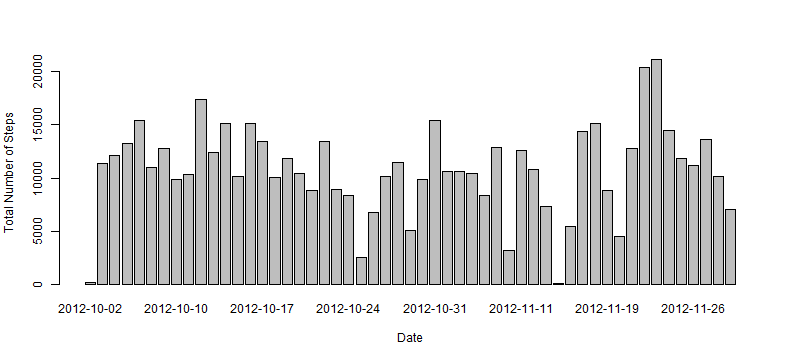
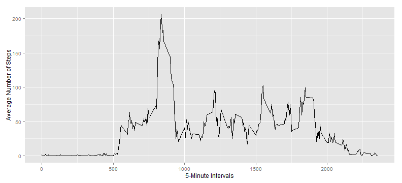
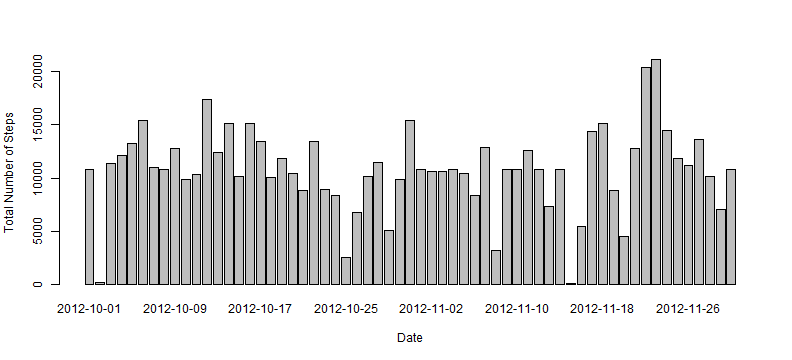
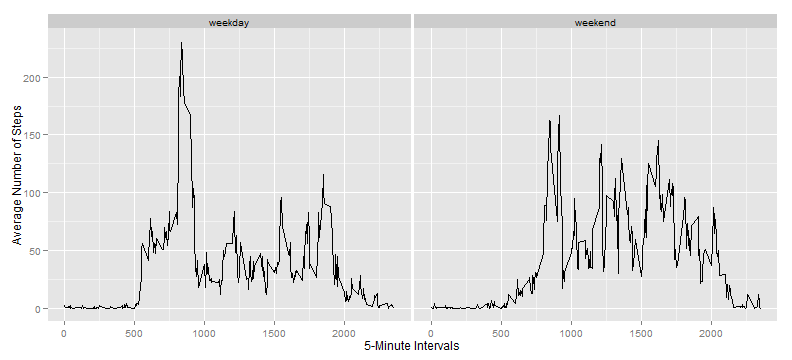

# Activity Monitoring Data Analysis


## Introduction
It is now possible to collect a large amount of data about personal movement using activity monitoring devices such as a [Fitbit](http://www.fitbit.com/), [Nike Fuelband](http://www.nike.com/us/en_us/c/nikeplus-fuelband) or [Jawbone Up](https://jawbone.com/up). These type of devices are part of the "quantified self" movement - a group of enthusiasts who take measurements about themselves regularly to improve their health, to find patterns in their behavior, or because they are tech geeks. But these data remain under-utilized both because the raw data are hard to obtain and there is a lack of statistical methods and software for processing and interpreting the data. 

This report makes use of data from a personal activity monitoring device. This device collects data at 5 minute intervals through out the day. The data consists of two months of data from an anonymous individual collected during the months of October and November, 2012 and include the number of steps taken in 5 minute intervals each day.
## Data  
### Data Source Location  
The data analysed in this report can be downloaded here:  
- [Activity Monitoring Dataset](https://d396qusza40orc.cloudfront.net/repdata%2Fdata%2Factivity.zip)  

To run the report the .zip file downloaded must be unzipped and placed in the R Working Directory.  
### Data Description  
The variables included in this dataset are:  
- **steps**: Number of steps taking in a 5-minute interval (missing values are coded as NA)  
- **date**: The date on which the measurement was taken in YYYY-MM-DD format  
-	**interval**: Identifier for the 5-minute interval in which measurement was taken  

The dataset is stored in a comma-separated-value (CSV) file and there are a total of 17,568 observations in this dataset.  

## Analysis
### Loading and preprocessing the data
First read data.

```r
activity<-read.csv("activity.csv",colClasses=c("integer","Date","integer"))
```
### Steps taken per day
Calculate sum, mean and median of total number of steps taken per day.

```r
dateSum<-aggregate(steps~date,data=activity,FUN=sum,na.action=na.omit)
dateMedian<-aggregate(steps~date,data=activity,FUN=median,na.action=na.omit)
dateMean<-aggregate(steps~date,data=activity,FUN=mean,na.action=na.omit)
dateTot<-merge(merge(dateSum,dateMean,by="date"),dateMedian,by="date")
names(dateTot)<-c("date","stepSum","stepMean","StepMedian")
dateTot
```

```
##          date stepSum stepMean StepMedian
## 1  2012-10-02     126   0.4375          0
## 2  2012-10-03   11352  39.4167          0
## 3  2012-10-04   12116  42.0694          0
## 4  2012-10-05   13294  46.1597          0
## 5  2012-10-06   15420  53.5417          0
## 6  2012-10-07   11015  38.2465          0
## 7  2012-10-09   12811  44.4826          0
## 8  2012-10-10    9900  34.3750          0
## 9  2012-10-11   10304  35.7778          0
## 10 2012-10-12   17382  60.3542          0
## 11 2012-10-13   12426  43.1458          0
## 12 2012-10-14   15098  52.4236          0
## 13 2012-10-15   10139  35.2049          0
## 14 2012-10-16   15084  52.3750          0
## 15 2012-10-17   13452  46.7083          0
## 16 2012-10-18   10056  34.9167          0
## 17 2012-10-19   11829  41.0729          0
## 18 2012-10-20   10395  36.0938          0
## 19 2012-10-21    8821  30.6285          0
## 20 2012-10-22   13460  46.7361          0
## 21 2012-10-23    8918  30.9653          0
## 22 2012-10-24    8355  29.0104          0
## 23 2012-10-25    2492   8.6528          0
## 24 2012-10-26    6778  23.5347          0
## 25 2012-10-27   10119  35.1354          0
## 26 2012-10-28   11458  39.7847          0
## 27 2012-10-29    5018  17.4236          0
## 28 2012-10-30    9819  34.0938          0
## 29 2012-10-31   15414  53.5208          0
## 30 2012-11-02   10600  36.8056          0
## 31 2012-11-03   10571  36.7049          0
## 32 2012-11-05   10439  36.2465          0
## 33 2012-11-06    8334  28.9375          0
## 34 2012-11-07   12883  44.7326          0
## 35 2012-11-08    3219  11.1771          0
## 36 2012-11-11   12608  43.7778          0
## 37 2012-11-12   10765  37.3785          0
## 38 2012-11-13    7336  25.4722          0
## 39 2012-11-15      41   0.1424          0
## 40 2012-11-16    5441  18.8924          0
## 41 2012-11-17   14339  49.7882          0
## 42 2012-11-18   15110  52.4653          0
## 43 2012-11-19    8841  30.6979          0
## 44 2012-11-20    4472  15.5278          0
## 45 2012-11-21   12787  44.3993          0
## 46 2012-11-22   20427  70.9271          0
## 47 2012-11-23   21194  73.5903          0
## 48 2012-11-24   14478  50.2708          0
## 49 2012-11-25   11834  41.0903          0
## 50 2012-11-26   11162  38.7569          0
## 51 2012-11-27   13646  47.3819          0
## 52 2012-11-28   10183  35.3576          0
## 53 2012-11-29    7047  24.4688          0
```
Make a histogram of the total number of steps taken each day.

```r
barplot(dateSum$steps,names.arg=dateSum$date,ylab="Total Number of Steps",xlab="Date")
```

 
### Daily activity pattern
Calculate the average number of steps taken per 5-minute interval across all days.

```r
intervalAvg<-aggregate(steps~interval,data=activity,FUN=mean,na.action=na.omit)
maxStep<-subset(intervalAvg,steps==max(intervalAvg$steps))$interval
```
The 5-minute interval that contains the maximum number is **835**.

Make a time series plot of the average number of steps taken per 5-minute interval across all days.

```r
qplot(intervalAvg$interval,intervalAvg$steps,geom="line",ylab="Average Number of Steps",xlab="5-Minute Intervals")
```

 
### Managing missing values
Calculate total number of rows with missing values.

```r
missingSteps<-sum(is.na(activity$steps))
missingDate<-sum(is.na(activity$date))
missingInterval<-sum(is.na(activity$interval))
missingTot<-sum(is.na(activity$steps)|is.na(activity$date)|is.na(activity$interval))
```
Total number of rows that contains missing values is **2304**:
- **2304** for *steps* variable
- **0** for *date* variable
- **0** for *interval* variable  

Replace *steps* variable missing values with the average number of steps taken per 5-minute interval across all days and create a new dataset that is equal to the original one but with the missing data filled in.

```r
allData<-merge(activity,intervalAvg,by="interval",suffixes=c("","Avg"))
allData[is.na(allData$steps),]$steps<-allData[is.na(allData$steps),]$stepsAvg
activityNew<-allData[order(allData$date,allData$interval),c(2,3,1)]
row.names(activityNew)<-1:nrow(activityNew)
```
Calculate sum, mean and median of total number of steps taken per day using the new dataset.

```r
dateSumNew<-aggregate(steps~date,data=activityNew,FUN=sum,na.action=na.omit)
dateMedianNew<-aggregate(steps~date,data=activityNew,FUN=median,na.action=na.omit)
dateMeanNew<-aggregate(steps~date,data=activityNew,FUN=mean,na.action=na.omit)
dateTotNew<-merge(merge(dateSumNew,dateMeanNew,by="date"),dateMedianNew,by="date")
names(dateTotNew)<-c("date","stepSum","stepMean","StepMedian")
dateTotNew
```

```
##          date stepSum stepMean StepMedian
## 1  2012-10-01   10766  37.3826      34.11
## 2  2012-10-02     126   0.4375       0.00
## 3  2012-10-03   11352  39.4167       0.00
## 4  2012-10-04   12116  42.0694       0.00
## 5  2012-10-05   13294  46.1597       0.00
## 6  2012-10-06   15420  53.5417       0.00
## 7  2012-10-07   11015  38.2465       0.00
## 8  2012-10-08   10766  37.3826      34.11
## 9  2012-10-09   12811  44.4826       0.00
## 10 2012-10-10    9900  34.3750       0.00
## 11 2012-10-11   10304  35.7778       0.00
## 12 2012-10-12   17382  60.3542       0.00
## 13 2012-10-13   12426  43.1458       0.00
## 14 2012-10-14   15098  52.4236       0.00
## 15 2012-10-15   10139  35.2049       0.00
## 16 2012-10-16   15084  52.3750       0.00
## 17 2012-10-17   13452  46.7083       0.00
## 18 2012-10-18   10056  34.9167       0.00
## 19 2012-10-19   11829  41.0729       0.00
## 20 2012-10-20   10395  36.0938       0.00
## 21 2012-10-21    8821  30.6285       0.00
## 22 2012-10-22   13460  46.7361       0.00
## 23 2012-10-23    8918  30.9653       0.00
## 24 2012-10-24    8355  29.0104       0.00
## 25 2012-10-25    2492   8.6528       0.00
## 26 2012-10-26    6778  23.5347       0.00
## 27 2012-10-27   10119  35.1354       0.00
## 28 2012-10-28   11458  39.7847       0.00
## 29 2012-10-29    5018  17.4236       0.00
## 30 2012-10-30    9819  34.0938       0.00
## 31 2012-10-31   15414  53.5208       0.00
## 32 2012-11-01   10766  37.3826      34.11
## 33 2012-11-02   10600  36.8056       0.00
## 34 2012-11-03   10571  36.7049       0.00
## 35 2012-11-04   10766  37.3826      34.11
## 36 2012-11-05   10439  36.2465       0.00
## 37 2012-11-06    8334  28.9375       0.00
## 38 2012-11-07   12883  44.7326       0.00
## 39 2012-11-08    3219  11.1771       0.00
## 40 2012-11-09   10766  37.3826      34.11
## 41 2012-11-10   10766  37.3826      34.11
## 42 2012-11-11   12608  43.7778       0.00
## 43 2012-11-12   10765  37.3785       0.00
## 44 2012-11-13    7336  25.4722       0.00
## 45 2012-11-14   10766  37.3826      34.11
## 46 2012-11-15      41   0.1424       0.00
## 47 2012-11-16    5441  18.8924       0.00
## 48 2012-11-17   14339  49.7882       0.00
## 49 2012-11-18   15110  52.4653       0.00
## 50 2012-11-19    8841  30.6979       0.00
## 51 2012-11-20    4472  15.5278       0.00
## 52 2012-11-21   12787  44.3993       0.00
## 53 2012-11-22   20427  70.9271       0.00
## 54 2012-11-23   21194  73.5903       0.00
## 55 2012-11-24   14478  50.2708       0.00
## 56 2012-11-25   11834  41.0903       0.00
## 57 2012-11-26   11162  38.7569       0.00
## 58 2012-11-27   13646  47.3819       0.00
## 59 2012-11-28   10183  35.3576       0.00
## 60 2012-11-29    7047  24.4688       0.00
## 61 2012-11-30   10766  37.3826      34.11
```
Make a histogram of the total number of steps taken each day using the new dataset.

```r
barplot(dateSumNew$steps,names.arg=dateSumNew$date,ylab="Total Number of Steps",xlab="Date")
```

 
### Differences between weekdays and weekends
Create a new factor variable in the dataset with two levels - "weekday" and "weekend" indicating whether a given date is a weekday or weekend day.

```r
weekFlag<-substr(weekdays(activityNew$date),1,1)
weekFlag[weekFlag!="S"]<-"weekday"
weekFlag[weekFlag=="S"]<-"weekend"
weekFlag<-as.factor(weekFlag)
activityWeek<-cbind(activityNew,weekFlag)
```
Calculate the average number of steps taken per 5-minute interval across all days using new dataset.

```r
intervalAvgWeek<-aggregate(steps~interval+weekFlag,data=activityWeek,FUN=mean,na.action=na.omit)
```
Make a panel plot containing a time series plot of the average number of steps taken per 5-minute interval across all weekday days or weekend days. 

```r
qplot(interval,steps,data=intervalAvgWeek,geom="line",facets=.~weekFlag,ylab="Average Number of Steps",xlab="5-Minute Intervals")
```

 


